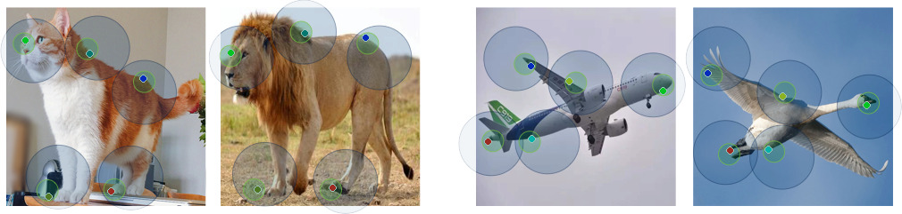

# Neural Best-Buddies in PyTorch

This is our PyTorch implementation for the Neural-Best Buddies paper.

The code was written by [Kfir Aberman](https://kfiraberman.github.io/) and supported by [Mingyi Shi](https://rubbly.cn/).

**Neural Best-Buddies: [Project](http://fve.bfa.edu.cn/recap/nbbs/) |  [Paper](https://arxiv.org/pdf/1805.04140.pdf)**


If you use this code for your research, please cite:

Neural Best-Buddies: Sparse Cross-Domain Correspondence
[Kfir Aberman](https://kfiraberman.github.io/), [Jing Liao](https://liaojing.github.io/html/), [Mingyi Shi](https://rubbly.cn/), [Dani Lischinski](http://danix3d.droppages.com/), [Baoquan Chen](http://www.cs.sdu.edu.cn/~baoquan/), [Daniel Cohen-Or](https://www.cs.tau.ac.il/~dcor/), SIGGRAPH 2018.

## Prerequisites
- Linux or macOS
- Python 2 or 3
- CPU or NVIDIA GPU + CUDA CuDNN

### Run

- Run the algorithm (demo example)
```bash
#!./script.sh
python3 main.py --datarootA ./images/original_A.png --datarootB ./images/original_B.png --name lion_cat --k_final 10
```
The option `--k_final` dictates the final number of returned points. The results will be saved at `../results/`. Use `--results_dir {directory_path_to_save_result}` to specify the results directory.

### Output
Sparse correspondence:
- correspondence_A.txt, correspondence_B.txt
- correspondence_A_top_k.txt, correspondence_B_top_k.txt

Dense correspondence (densifying based on [MLS](http://faculty.cse.tamu.edu/schaefer/research/mls.pdf)):
-  BtoA.npy, AtoB.npy

Warped images (aligned to their middle geometry):
- warp_AtoM.png, warp_BtoM.png

### Tips
- If you are running the algorithm on a bunch of pairs, we recommend to stop it at the second layer to reduce runtime (comes at the expense of accuracy), use the option `--fast`.
- If the images are very similar (e.g, two frames extracted from a video), many corresponding points might be found, resulting in long runtime. In this case we suggest to limit the number of corresponding points per level by setting `--points_per_level 20` (or any other desired number)

## Citation
If you use this code for your research, please cite our paper:
```
@article{aberman2018neural,
  author = {Kfir, Aberman and Jing, Liao and Mingyi, Shi and Dani, Lischinski and Baoquan, Chen and Daniel, Cohen-Or},
  title = {Neural Best-Buddies: Sparse Cross-Domain Correspondence},
  journal = {ACM Transactions on Graphics (TOG)},
  volume = {37},
  number = {4},
  pages = {69},
  year = {2018},
  publisher = {ACM}
}

```
